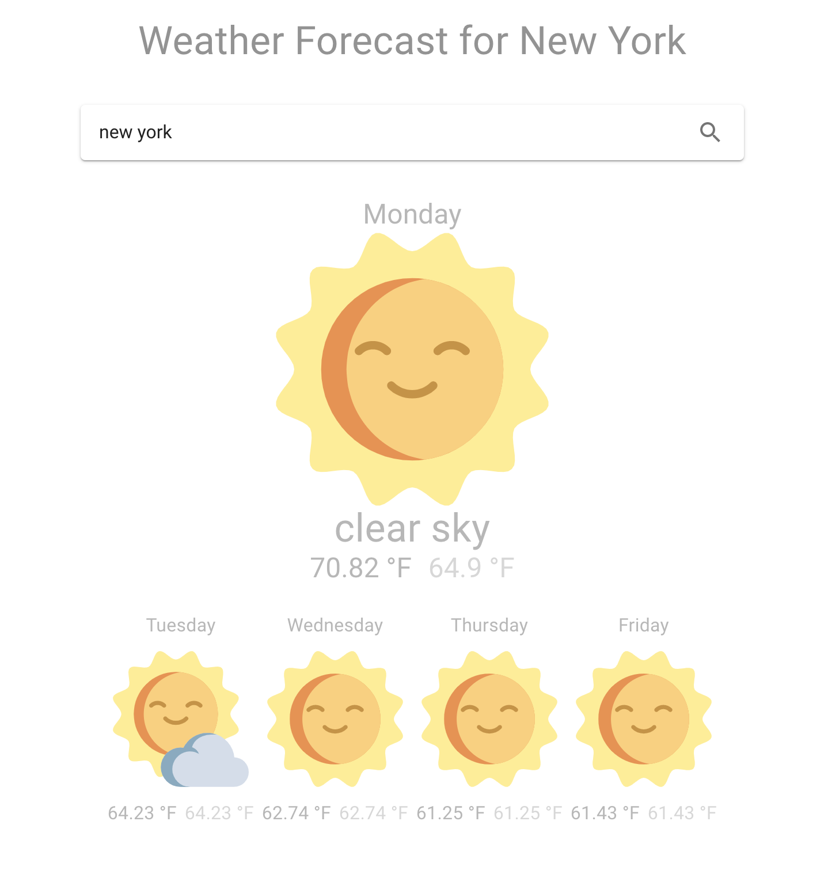

## Weather Forecast 

**A simple weather application to provide a worldwide weather forecast for cities**



## Project setup

### Clone the repo

```shell
$ git clone https://github.com/Oscarz90/WeatherForecastApp.git
```

### Install the dependencies

```shell
WeatherForecastApp$ yarn install
```

[](https://asciinema.org/a/268702)

### Compiles and hot-reloads for development

```
WeatherForecastApp$ yarn start
```

[](https://asciinema.org/a/Y9nLs13ngZg3gwI4ndMWgNclJ)

### Compiles and minifies for production

```
WeatherForecastApp$ yarn run build
```

[](https://asciinema.org/a/2e6dRaMgKAFW2G8p87I78l2AW)

### Run and serve it with a static server

```
WeatherForecastApp$ yarn global add serve
WeatherForecastApp$ serve -s build
```

[](https://asciinema.org/a/268706)
